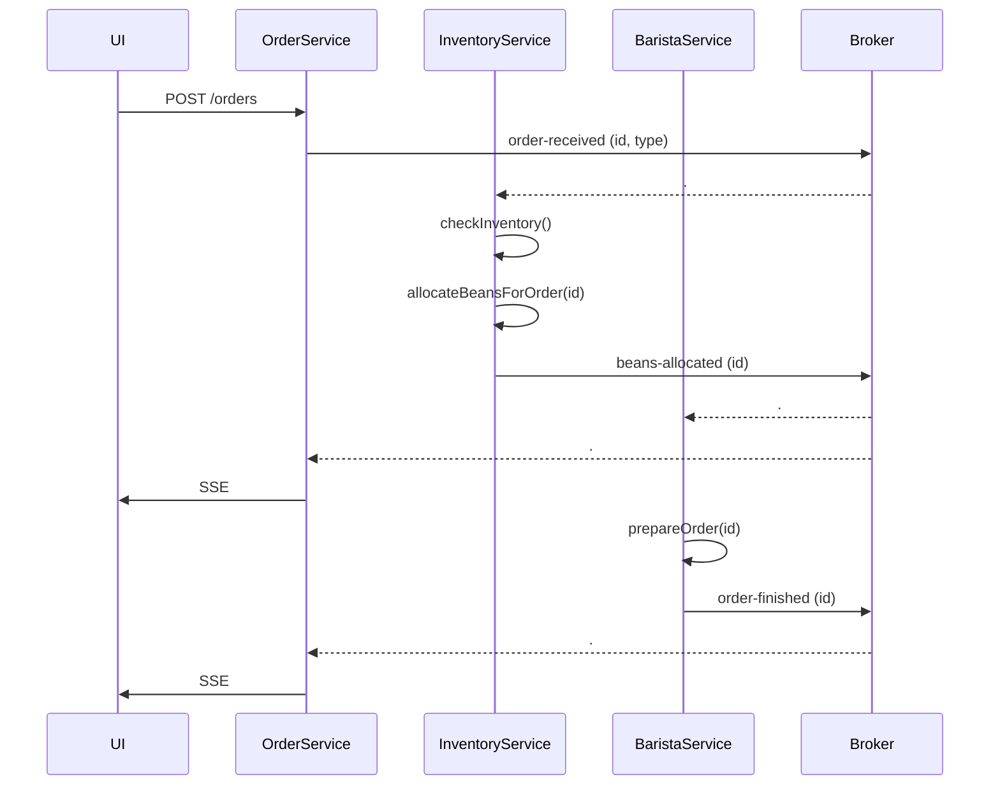

# CoffeeShop

```mermaid
sequenceDiagram
   participant UI
   participant OrderService
   participant InventoryService
   participant BaristaService
   participant Broker

UI->>OrderService: POST /orders
OrderService->>Broker: order-received (id, type)
Broker-->>InventoryService: .

InventoryService->>InventoryService: checkInventory()
InventoryService->>InventoryService: allocateBeansForOrder(id)
InventoryService->>Broker: beans-allocated (id)  
Broker-->>BaristaService: .
Broker-->>OrderService: .
OrderService->>UI: SSE
BaristaService->>BaristaService: prepareOrder(id)
BaristaService->>Broker: order-finished (id)
Broker-->>OrderService: .
OrderService->>UI: SSE
```
